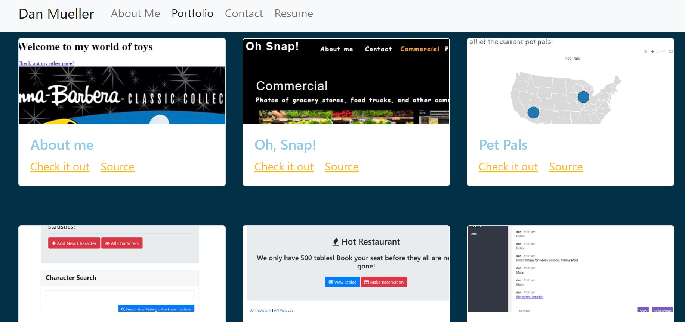

# React Pathway Portfolio

This project is the beginning of a portfolio built with React. It contains the following:

- A brief biography with screenshot
- A Projects page with links to deployed project and code
- A Contact page used to exercise some React functionality; Note that this app does not have a back end, so the contact page serves as only a placeholder for now
- A resume page that shows a list of skills and gives an option to download a current resume

This project was bootstrapped with [Create React App](https://github.com/facebook/create-react-app).

This project has been published to GitHub Pages using the gh-pages npm package.

Note: Below is taken from the default Create React App README.md

---
## Available Scripts

In the project directory, you can run:

### `npm start`

Runs the app in the development mode.\
Open [http://localhost:3000](http://localhost:3000) to view it in the browser.

The page will reload if you make edits.\
You will also see any lint errors in the console.

### `npm test`

Launches the test runner in the interactive watch mode.\
See the section about [running tests](https://facebook.github.io/create-react-app/docs/running-tests) for more information.

### `npm run build`

Builds the app for production to the `build` folder.\
It correctly bundles React in production mode and optimizes the build for the best performance.

The build is minified and the filenames include the hashes.\
Your app is ready to be deployed!

See the section about [deployment](https://facebook.github.io/create-react-app/docs/deployment) for more information.

